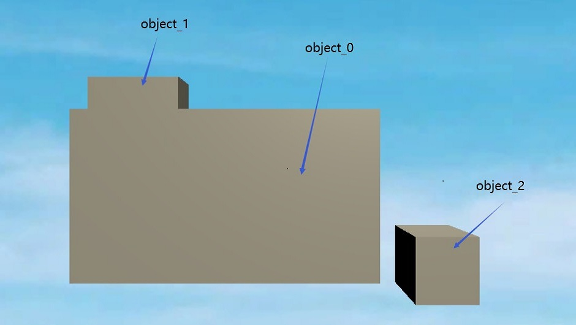
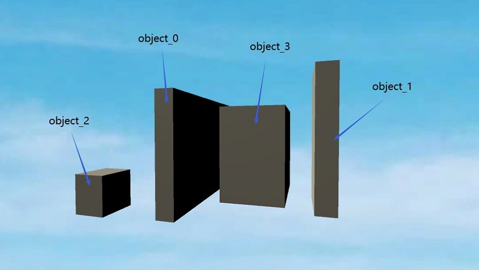
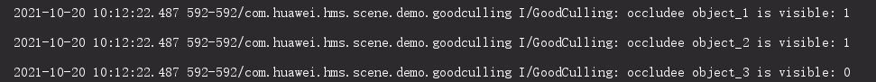

# HMS Core Scene Kit Good Culling Demo

English | [中文](README_ZH.md)

## Table of Contents

* [Introduction](#introduction)
* [Supported Environments](#supported-environments)
* [Scene](#scene)
* [Result](#result)
* [License](#license)

## Introduction

Good Culling is a part of Scene Kit, a component of the Huawei HMS Core. This sample code demonstrates how to call the exporting api of libCoreCulling.so to perform occlusion culling calculations.

## Supported-Environments

* AndroidStuido 3.5.2 or a later version is recommended.
* Java SDK 1.8 or later
* Gradle 4.0 or later
* NDK 21.0.6113669 or later
* HMS Core (APK) 4.0.2.300 or later
* EMUI 10.0 or later

## Scene

In the scene of this SampleCode demo, there are 4 objects. The following graphic shows the front view of the scene, the same view when running the application:

In the same time the side view of the scene is as the follows:

## Result

android logout:

notice：the result 1 means not being occludeed, the result 0 means being occludeed. 

## Question or issues

If you want to evaluate more about HMS Core,
[r/HMSCore on Reddit](https://www.reddit.com/r/HuaweiDevelopers/) is for you to keep up with latest news about HMS Core, and to exchange insights with other developers.

If you have questions about how to use HMS samples, try the following options:

- [Stack Overflow](https://stackoverflow.com/questions/tagged/huawei-mobile-services?tab=Votes) is the best place for any programming questions. Be sure to tag your question with 
  `huawei-mobile-services`.
- [Huawei Developer Forum](https://forums.developer.huawei.com/forumPortal/en/home?fid=0101187876626530001) HMS Core Module is great for general questions, or seeking recommendations and opinions.

If you run into a bug in our samples, please submit an [issue](https://github.com/HMS-Core/hms-scene-GoodCulling-demo/issues) to the Repository. Even better you can submit a [Pull Request](https://github.com/HMS-Core/hms-scene-GoodCulling-demo/pulls) with a fix.

## License

HMS Core Scene Kit Good Culling Demo is licensed under the [Apache License, version 2.0](http://www.apache.org/licenses/LICENSE-2.0).
